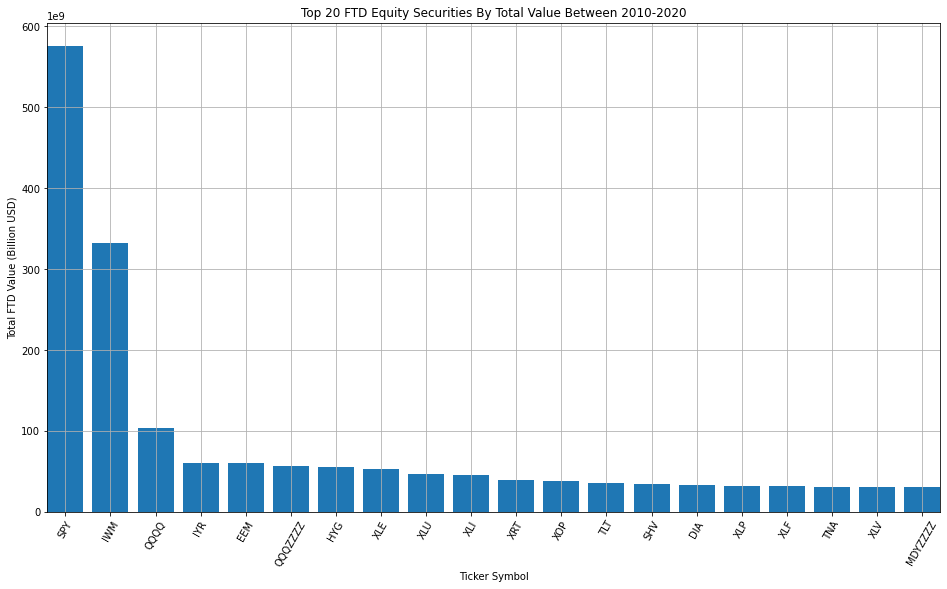
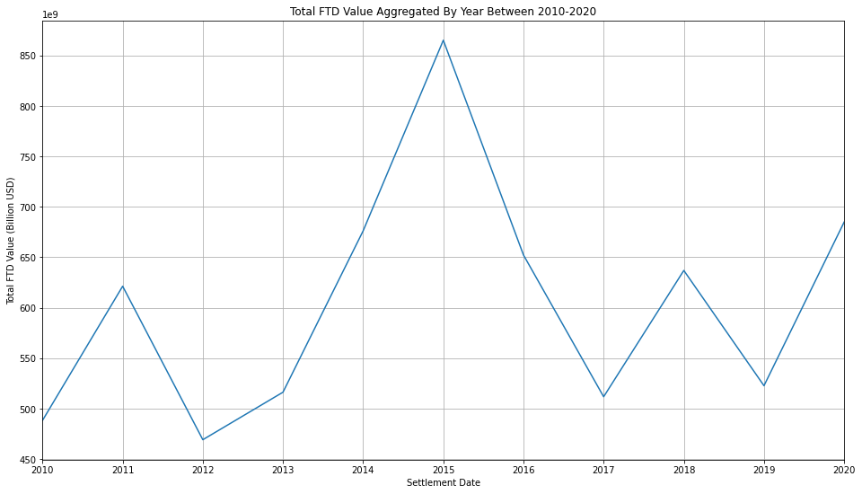
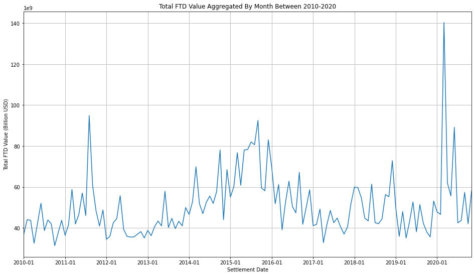
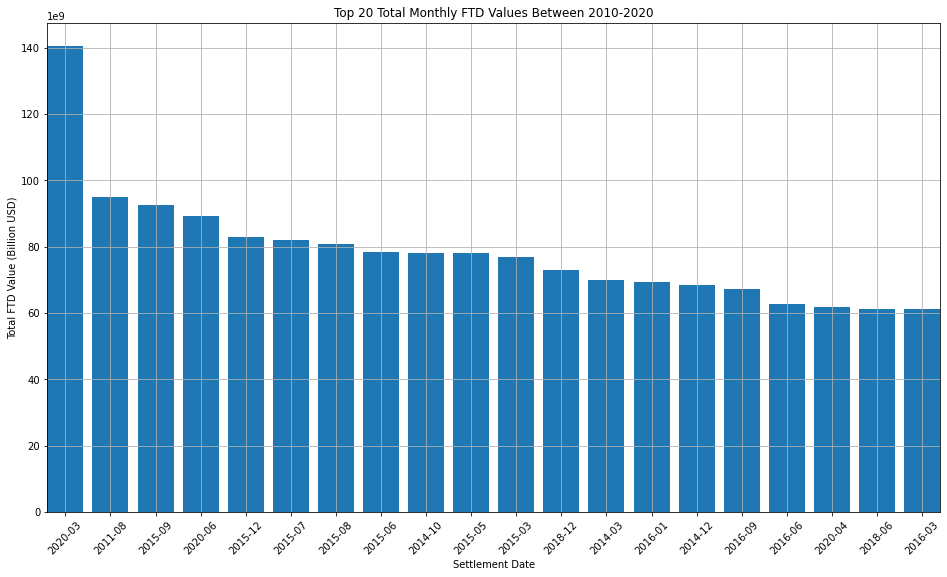
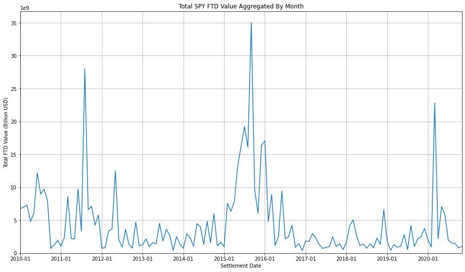
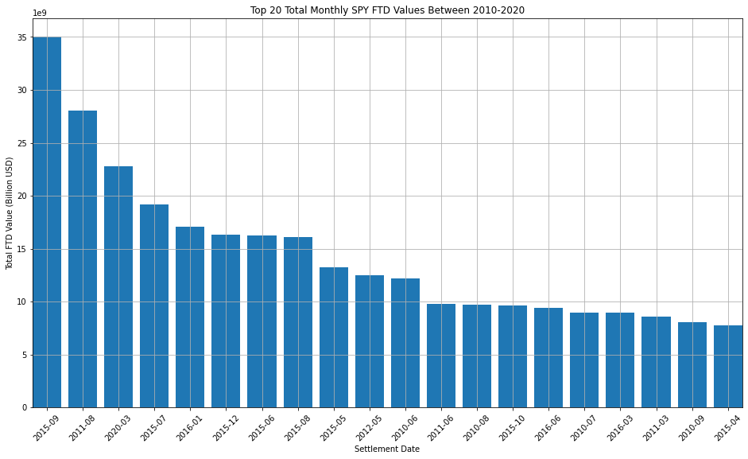

# Fail to Deliver

Visualizing fail to deliver (FTD) data from the US Securities and Exchange Commission (SEC)

The intent is not to explain the consequences of FTDs nor support/oppose "naked" short selling. 

## What is Fail To Deliver?

As described by the [SEC](https://www.sec.gov/investor/pubs/regsho.htm):
> A **failure to deliver** occurs when a broker-dealer fails to deliver securities to the party on the other side of the transaction on the settlement date.

## What is "Naked" Short Selling?

As described by the [SEC](https://www.sec.gov/investor/pubs/regsho.htm):
>In a **"naked" short sale**, the seller does not borrow or arrange to borrow the securities in time to make delivery to the buyer within the standard three-day settlement period.

"Naked" short selling contributes to FTDs but is not the sole contributor as FTDs can occur from both short and long sales.

## Dataset

The [Fails-to-Deliver Data](https://www.sec.gov/data/foiadocsfailsdatahtm) contains:
> the date, CUSIP numbers, ticker symbols, issuer name, price, and total number of fails-to-deliver (i.e., the balance level outstanding) recorded in the National Securities Clearing Corporation's ("NSCC") Continuous Net Settlement (CNS) system aggregated over all NSCC members.

Important note about the data:
> Fails to deliver on a given day are a cumulative number of all fails outstanding until that day, plus new fails that occur that day, less fails that settle that day. The figure is not a daily amount of fails, but a combined figure that includes both new fails on the reporting day as well as existing fails. In other words, these numbers reflect aggregate fails as of a specific point in time and may have little or no relationship to yesterday's aggregate fails.

The range of data analyzed was from 2010 to 2020.

## Results

Between 2010 to 2020, the top 20 FTD equity securities by total value are all exchange traded funds (ETFs).

Note that the ticker symbols suffixed with "ZZZZ" represent transitioned securities. For example: QQQ shown as "QQQQ" and "QQQQZZZZ" transitioned from PowerShares QQQ Trust to Invesco QQQ Trust.

It is not surprising to see the top three being popular index ETFs.

| Ticker Symbol | Description   |
|---            |---            |
| SPY           | SPDR S&P 500 ETF Trust |
| IWM           | iShares Russell 2000 ETF |
| QQQ           | Invesco QQQ Trust |

### Yearly Aggregates

No interesting results from the yearly aggregates, unless you consider the spike in 2015.

### Monthly Aggregates

Given finer granularity, we see a distinct peak around 2020-03.

### Monthly Aggregates - SPY

From the SPY monthly aggregates, we see three snapshots where the total SPY FTD value peaked.

Possible explanations: 

| Settlement Date | Description |
|---              |---              |
| 2011-08         | [Black Monday](https://en.wikipedia.org/wiki/Black_Monday_(2011)) |
| 2015-09         | [Flash Crash, Asian Market Tensions, and Fed Uncertainty](https://en.wikipedia.org/wiki/2015%E2%80%932016_stock_market_selloff) |
| 2020-03         | [Coronavirus (COVID-19)](https://en.wikipedia.org/wiki/2020_stock_market_crash) |

## Conclusion

Perhaps more interesting results and correlations can be drawn if the FTD data is combined with other financial and macro data sets.
